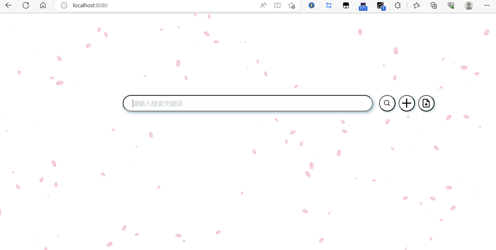
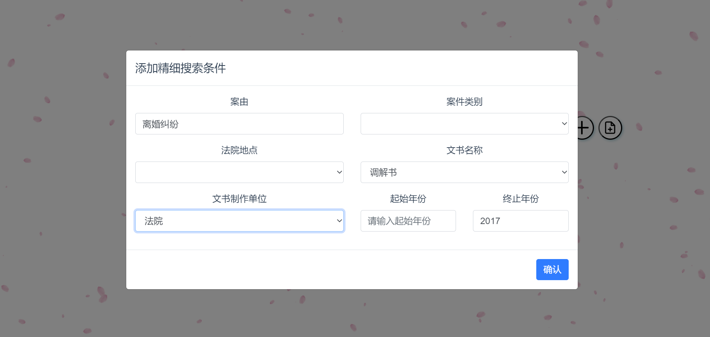
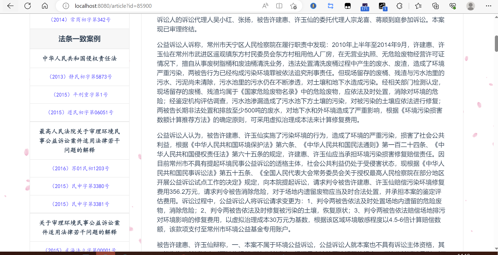
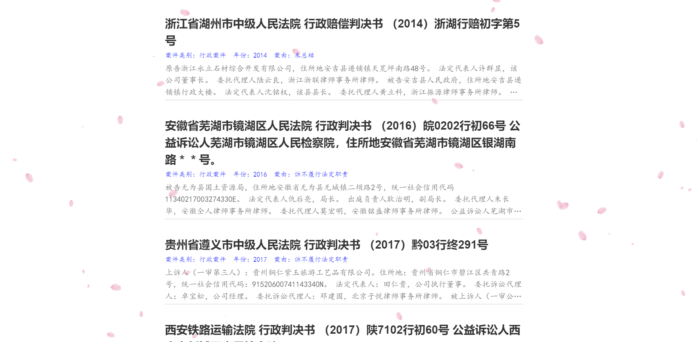

# 司法搜索引擎 - 实验报告

## 问题描述

使用助教提供的`Legal_data.zip`数据集（XML格式），实现一个Demo级别的司法搜索系统。需要实现前端界面、关键词检索、类案检索等必做功能，以及精细化检索、高亮、标签显示、查询推荐、相似案例推荐等选做功能。

## 实现模块

### 预处理

`./process/`为预处理的文件夹，用于离线地得到各种后端需要的数据。

各模块如下：

`extract_xml.py`：

预处理XML文件中的内容，生成容易访问的json文件，提取了正文、标题、文书制作单位、文书种类、经办法院、文书名称、案号、案件类型、省份、城市（最后没有使用到）、年份、案由、案件类别（最后处理成几类）、涉及法条。

最后得到结果的一个例子如下：

```json
{
    "text": "浙江省东阳市人民法院 民事判决书 （2016）浙0783民初17571号 原告：韦斌姬，女，1972年9月22日出生，汉族，住东阳市。 被告：韦斌强，男，1969年6月17日出生，汉族，住东阳市。 被告：杜满萍，女，1968年11月25日出生，汉族，住东阳市。 委托代理人：陈菊华、贾凌珂。 原告韦斌姬为与被告韦斌强、杜满萍民间借贷纠纷一案，于2016年12月1日向本院提起诉讼，请求判令两被告归还借款10万元，并支付利息（自起诉之日起按中国人民银行同期同档次贷款基准利率计算至实际履行之日止）。本院受理后，依法由审判员甘震适用简易程序独任审判。被告杜满萍在提交答辩状期间对管辖权提出异议，本院裁定予以驳回。杜满萍不服该裁定，上诉至金华市中级人民法院。后金华市中级人民法院驳回上诉，维持原裁定。2017年4月20日，被告杜满萍申请对借条中“杜满萍”的签名是否系其本人书写进行鉴定，本院依法委托金华天鉴司法鉴定所进行鉴定。本院于2017年7月6日公开开庭审理了本案。原告韦斌姬、被告韦斌强及被告杜满萍的委托代理人贾凌珂到庭参加了诉讼。本案现已审理终结。 本院经审理查明：2011年4月25日，被告韦斌强、杜满萍向原告韦斌姬借款10万元，并共同出具了借条一份，内容为：“今向韦斌姬借人民币拾万元正。”庭审中，原告韦斌姬自认被告杜满萍已归还款项2.4万元，其余款项未归还。被告韦斌强陈述其分文未还。被告杜满萍陈述其对案涉借款不知情，故分文未还。在本案审理过程中，被告杜满萍申请对借条中“杜满萍”的签名是否系其本人书写进行鉴定，本院依法委托金华天鉴司法鉴定所进行鉴定，鉴定意见为借条落款处的“杜满萍”的签名字迹与杜满萍样本字迹系同一人书写形成。 本院依照《中华人民共和国合同法》第二百零六条、第二百零七条之规定，判决如下： 一、被告韦斌强、杜满萍于本判决生效之日起十日内归还原告韦斌姬借款7.6万元，并支付利息（自2016年12月1日起按中国人民银行公布的同期同档次贷款基准利率计算至实际归还之日止）。 二、驳回原告韦斌姬的其他诉讼请求。 如果被告未按本判决指定的期间履行给付金钱义务，应当依照《中华人民共和国民事诉讼法》第二百五十三条之规定，加倍支付迟延履行期间的债务利息。 案件受理费2300元，减半收取1150元，由原告韦斌姬负担276元，由被告韦斌强、杜满萍负担874元；鉴定费3200元（已由被告杜满萍预交），由被告杜满萍负担。 如不服本判决，可在本判决书送达之日起十五日内向本院递交上诉状，并按对方当事人的人数提出副本，上诉于浙江省金华市中级人民法院。 审判员甘震 二〇一七年七月七日 代书记员许天瑶 ",
    "title": "浙江省东阳市人民法院 民事判决书 （2016）浙0783民初17571号 ",
    "wszzdw": "法院",
    "fywszl-wszl": "裁判文书",
    "jbfy-cbjg": "浙江省东阳市人民法院",
    "wsmc": "判决书",
    "ah": "（2016）浙0783民初17571号",
    "ajlx-ajlb": "民事一审案件",
    "province": "浙江",
    "city": "金华市",
    "year": "2017",
    "reason": [
        "民间借贷纠纷"
    ],
    "ajlbsimple": "民事",
    "ft": [
        "中华人民共和国合同法"
    ]
}
```

`get_index.py`：

用whoosh库建立索引，需要建立索引的字段：text、wszzdw、wsmc、year、reason、province、ajlbsimple、fywszl-wszl，其中year是INT类型，其他都是TEXT类型。text和reason是检索字段，其他都是筛选字段。在构建索引前会去除停用词。

`get_es_index.py`：

在发现whoosh性能**过于差**之后，又实现了一个elastic search的版本，其他同上。使用时需要开启elastic search的服务。

`get_vector_index.py`：

使用faiss库建立稠密向量索引，向量的生成使用Lawformer，具体见`/search/match.py`的描述。

`get_database.py`：

建立一个sqlite3数据库，用于相似案例推荐的查询。

共两个表：表一储存法条字段和对应的docid，在法条字段建立索引；表二，存储docid到内容相似案例的映射。内容相似案例使用上文提到的LawFormer得到的向量结合faiss库进行查询，调用了`./search/match.py`。

`lawwords.py`：

处理法律词汇，以用于构建字典树，用于查询补全。处理流程如下：先将THUNLP的OCL词库的法律部分作为基础词库，对于助教提供的法律文书XML文件，提取其中各节点的value值：按中文标点和空格分割后，选取列表长度小于等于3的结果，以字典的形式保存下来，字典的值是出现次数，用于补全时的排序。最后得到一个200w大小的法律词汇集合。

`utils.py`：

将停用词表读入内存。

`stat.py`：

统计XML文件处理后的各个字段，主要用于预处理探索阶段。

### 检索

位于`./search/`文件夹下，是搜索、匹配等算法的核心模块。

**`trie_tree.py`：**

实现了Trie树，使用上文得到的法律词汇（多了一步操作：将长度大于25的词语，以及包含数字的词语去掉；最后得到130w个法律词汇）来构建Trie树（在每次后端跑起来的时候会构建一次写入内存）。

提供了`get_recommend_words(word, num)`函数，传入搜索词汇，在Trie树中获得以该词汇为前缀的所有词汇，按出现次数排序，返回num个。


**`match.py`：**

类案检索算法的实现。提供如下几个接口：

`text2vector(text, max_length=4096)`：使用LawFormer模型将文本转换为稠密向量。具体是获得[CLS]对应的last_hidden_state作为文本的向量。

`match(text, max_length=500, limit=10, bm25=False, vector_limit=None, bm25_p=0, search_func=None)`：类案检索算法，其中search_func是外部传入的，可以是用whoosh或es实现的search函数。limit表示返回的结果数，bm25表示是否在稠密检索后加入稀疏检索，vector_limit表示稠密检索返回的结果数，bm25_p用于限制最后返回的分数阈值，如果bm25_p = 0表示不采取分数截断。

另外，稠密检索使用的是faiss库提供的搜索算法。

`get_match_ft(ft, num)`：从sqlite3数据库中获得该案件法条匹配的类案，随机返回num条。

`get_match_text(docid, num)`：从sqlite3数据库中获得该案件文本匹配的类案，随机返回num条。


**`search.py`：**

`search(search_dict, limit=None, p=0)`：使用whoosh库的搜索算法实现，评分函数是`BM25F`。search_dict传入各个字段的搜索词，p是指分数小于top2_score \* p的结果不返回。搜索关键词、案由关键词采用`Or`策略，年份字段采用`NumericRange`策略，而其他字段均是精确匹配。


**`es_search.py`：**

`search(search_dict, limit=None, p=0)`：也提供了whoosh算法类似的接口，这也是本代码最终的默认实现。


### 后端

位于`./flask/`文件夹下。

使用flask搭建后端，共提供了以下API接口（都需要调用`./search/`文件夹下的内容）：

#### search

关键词搜索的函数，从前端获得关键词，及（可选的）精细化搜索的条件，返回搜索结果及搜索时间。

#### match

类案匹配的函数，从前端获得上传的文件，返回匹配结果及匹配时间。

#### show

文章展示页面获取文章内容的函数，从前端获得docid，返回文章内容，包括标签、正文、相似案例的匹配等结果。

#### recommend

获得查询词的推荐词的接口，从前端获得查询词，返回推荐补全的词汇。


`config.py`文件夹用于配置搜索算法，可以选择关键词检索是用whoosh还是elastic search、搜索返回个数（默认为40）、匹配返回个数（默认为40）、案件匹配的算法（可选稠密检索、稀疏检索或二者的组合）。

### 前端

位于`./bebr2-legal/`文件夹下

前端使用Vue搭建，主要包括以下模块：

#### SearchForm

是一个组件，实现了精细化搜索的选择对话框。

#### UploadForm

是一个组件，实现了类案检索上传文件的对话框。

#### HomeView

搜索的主页，实现了搜索、结果展示以及上述两个组件的实例化，以及实现了几个与后端接口交互的的函数。另外还实现了高亮等选做功能对应的函数，详细见代码注释。

#### Article

文章展示的页面，通过docid向后端获取信息并展示。

## 关键功能

**首页展示：**其他细节见下。




### 关键词检索

用户可以输入关键词进行检索，搜索结果的展示**见下文“测试结果”**的分析。

关键词检索实现了whoosh的BM25F和elastic search的“practical scoring function”，默认使用更快的elastic search。

### 类案检索

用户可以上传一个文本文件进行类案检索，其中上传的界面如图，搜索结果的展示**见下文“测试结果”**的分析。


另外，如上文提到，类案检索实现的算法可以在`config.py`中进行修改，可以自行选择三种匹配方式：稠密检索、稀疏检索、稠密检索 + 稀疏检索的精排。加上调用不同的稀疏检索方式（whoosh的BM25F和elastic search的“practical scoring function”），最多有五种组合。下文没有特殊说明，默认使用elastic search的稀疏检索，因为最省时。

### 精细化检索

用户可以点击"+"按钮添加精细搜索条件，这些条件从XML的各字段提取，可以作为关键词搜索的限制。

展示如下：



使用上述条件，加上关键词“婚姻家庭纠纷”，搜索结果如下：


可以看到结果确实和婚姻、家庭以及离婚有关（注意“案由”字段是模糊检索，而不是精确匹配），时间也被限制为2017年以前，且都是法院的民事调解书。

### 高亮（关键词飘红）

实现了关键词飘红（注意只飘红搜索框的字段，精细搜索和类案检索没有进行飘红处理。

实现时没有简单地按字来飘红，因为这样可能会有一些不相关的字被飘红，采用了jieba分词后的结果来飘红，例如下面的例子，虽然“中”字出现在搜索词中，但由于不是一个独立的词，搜索结果中“中级法院”“延中民再字”等的“中”字没有被飘红。


### 标签显示

标签也是提取于XML文件，展示了案件类型、文书名称、经办机构、年份（以上在标题下展示）、案号、文书制作单位、案由（以上在左侧展示）。用户可以清晰地看到案件的各种属性，便于快速筛选有用信息。


另外，案件类别、年份、案由等标签也在搜索展示页面直接展示，具体可以见上一个部分的展示图。

### 相似案例推荐

相似案例包括“内容相似推荐”和“法条一致案例”进行推荐。内容相似推荐采用LawFormer离线计算各篇文章的向量，然后对每篇数据库中的文章进行余弦相似度的计算，获得最相似的8篇案例，在展示该文章时随机抽取三篇展示；法条一致案例则是通过“法条”标签，离线计算各法条对应的文书，然后在展示文章时随机抽取展示。具体展示见上图和下图：



### 查询补全

查询补全会动态地根据用户输入提示查询词，用户可以方便地点击补全的词直接搜索，具体算法在“实现模块”中描述，不再赘述。

展示如下：


## 测试结果和样例分析

### 测试关键词

使用关键词“**清华大学玉泉医院**”进行查询，部分结果展示如下：


对于前十个结果（第一页的结果），标注如下（相关性的判断如下：点进去看全文，如果有涉及清华大学的玉泉医院的内容，判断为相关）：

| 排名 | 标题                                                         | 相关性 |
| ---- | ------------------------------------------------------------ | ------ |
| 1    | 北京市第三中级人民法院 民事判决书 （2016）京03民终2447号     | 相关   |
| 2    | 北京市高级人民法院 民事裁定书 （2015）高民申字第03300号      | 相关   |
| 3    | 北京市海淀区人民法院 民事判决书 （2017）京0108民初54184号    | 相关   |
| 4    | 陕西省咸阳市中级人民法院 刑事判决书 （2016）陕04刑初49号     | 相关   |
| 5    | 呼和浩特市玉泉区人民法院 民事判决书 （2015）玉民一初字第00510号 | 不相关 |
| 6    | 呼和浩特市人民检察院 起诉书 呼检公一刑诉（2017）3号          | 不相关 |
| 7    | 北京市第一中级人民法院 民事判决书 （2017）京01民终7167号     | 不相关 |
| 8    | 内蒙古自治区高级人民法院 刑事裁定书 （2016）内刑终108号      | 不相关 |
| 9    | 呼和浩特市玉泉区人民法院 民事判决书 （2014）玉民一初字第00378号 | 不相关 |
| 10   | 甘肃省天水市秦州区人民法院 民事判决书 （2011）秦郡民初字第153号 | 不相关 |

#### 构建Pooling池

前文提到本仓库还实现了其他关键词检索算法，这里采用Whoosh提供的BM25F方法作为第二个搜索算法，以构建Pooling池。检索结果如下，可以看到明显whoosh的速度不如es：


| 排名 | 标题                                                         | 相关性 |
| ---- | ------------------------------------------------------------ | ------ |
| 1    | 北京市第一中级人民法院 民事判决书 （2017）京01民终7167号     | 不相关 |
| 2    | 北京市第三中级人民法院 民事判决书 （2016）京03民终2447号     | 相关   |
| 3    | 北京市高级人民法院 民事裁定书 （2015）高民申字第03300号      | 相关   |
| 4    | 北京市第二中级人民法院 民事判决书 （2004）二中民初字第7055号 | 不相关 |
| 5    | 广东省广州市天河区人民法院 民事判决书 （2016）粤0106民初17562号 | 不相关 |
| 6    | 北京市高级人民法院 民事判决书 （2005）高民终字第923号        | 不相关 |
| 7    | 北京市海淀区人民法院 民事判决书 （2016）京0108民初33437号    | 不相关 |
| 8    | 重庆市渝北区人民法院 民事判决书 （2017）渝0112民初20204号    | 不相关 |
| 9    | 北京市海淀区人民法院 民事判决书 （2017）京0108民初54184号    | 相关   |
| 10   | 北京市丰台区人民法院 民事判决书 （2016）京0106民初13836号    | 不相关 |

两种方法共得到16个案例，其中4个相关案例。

#### 评分计算

比较es默认算法（本代码默认使用）和whoosh的bm25f算法：

在查询词为“清华大学玉泉医院”条件下，两种方法评分如下：

| 搜索方法                     | AP    | P@10 | RR   | Success@10 |
| ---------------------------- | ----- | ---- | ---- | ---------- |
| es默认算法（本代码默认使用） | 1.0   | 0.4  | 1.0  | 1          |
| whoosh的bm25f算法            | 0.375 | 0.3  | 0.5  | 1          |

可以看到第二种方法的效果也不如第一种好。

### 测试案例

使用了在“北大法宝”下载的**北京市人民检察院第四分院诉朱清良、朱清涛环境污染民事公益诉讼案**进行案件匹配，该案例的链接如下[指导案例206号：北京市人民检察院第四分院诉朱清良、朱清涛环境污染民事公益诉讼案-北大法宝V6官网 (pkulaw.com)](https://www.pkulaw.com/gac/f4b18d978bc0d1c7fb0a4d5c0233df92173e343bc0df58d4bdfb.html)。将其复制为txt文件后进行匹配。

部分结果展示如下：





对于前十个结果（第一页的结果），标注如下（相关性的判断如下：由于该案例涉及“生态环境功能损失赔偿”“环境污染与修复”，所以正文涉及其中某一类的案例标注为相关）：

| 排名 | 标题                                                         | 相关性 |
| ---- | ------------------------------------------------------------ | ------ |
| 1    | 江苏省常州市中级人民法院 民事判决书 （2015）常环公民初字第1号 公益诉讼人江苏省常州市人民检察院，住所地江苏省常州市永宁北路10号。 | 相关   |
| 2    | 江苏省南京市中级人民法院 民事判决书 （2016）苏01民初1203号   | 相关   |
| 3    | 江苏省苏州市中级人民法院 刑事裁定书 （2017）苏05刑终933号    | 相关   |
| 4    | 贵州省仁怀市人民法院 行政判决书 （2017）黔0382行初4号 公益诉讼人纳雍县人民检察院，住所地：贵州省毕节市纳雍县新城区政法园区。 | 相关   |
| 5    | 浙江省湖州市中级人民法院 行政赔偿判决书 （2014）浙湖行赔初字第5号 | 相关   |
| 6    | 安徽省芜湖市镜湖区人民法院 行政判决书 （2016）皖0202行初66号 公益诉讼人芜湖市镜湖区人民检察院，住所地安徽省芜湖市镜湖区银湖南路＊＊号。 | 相关   |
| 7    | 贵州省遵义市中级人民法院 行政判决书 （2017）黔03行终291号    | 相关   |
| 8    | 西安铁路运输法院 行政判决书 （2017）陕7102行初60号 公益诉讼人西安市新城区人民检察院。 | 相关   |
| 9    | 广东省珠海横琴新区人民法院 刑事判决书 （2017）粤0491刑初43号 | 相关   |
| 10   | 云南省昆明市中级人民法院 民事判决书 （2012）昆环保民初字第6号 公益诉讼人云南省宜良县国土资源局 | 相关   |

#### 构建Pooling池

前文提到本仓库还实现了其他类案检索算法，这里采用LawFormer向量检索的方法作为第二个搜索算法，以构建Pooling池。LawFormer的匹配结果如下：

| 排名 | 标题                                                         | 相关性 |
| ---- | ------------------------------------------------------------ | ------ |
| 1    | 中华人民共和国最高人民法院 民事裁定书 （2015）民申字第3377号 | 相关   |
| 2    | 中华人民共和国最高人民法院 民事裁定书 （2015）民申字第3381号 | 相关   |
| 3    | 中华人民共和国最高人民法院 民事裁定书 （2015）民申字第3381号 | 相关   |
| 4    | 北京市第一中级人民法院 行政判决书 （2018）京01行初24号       | 不相关 |
| 5    | 杭州市拱墅区人民法院 民事裁定书 （2017）浙0105民初8114号     | 不相关 |
| 6    | 中华人民共和国最高人民法院 民事裁定书 （2012）民监字第539号  | 不相关 |
| 7    | 中华人民共和国最高人民法院 民事裁定书 （2017）最高法民再121号 | 不相关 |
| 8    | 海南省高级人民法院 民事裁定书 （2013）琼立一终字第155号      | 不相关 |
| 9    | 北京市朝阳区人民法院 民事判决书 （2016）京0105民初71177号    | 不相关 |
| 10   | 北京市第一中级人民法院 行政判决书 （2017）京01行初1134号     | 不相关 |

两种方法共得到20个案例，其中13个相关案例。

#### 评分计算

| 搜索方法                     | AP   | P@10 | RR   | Success@10 |
| ---------------------------- | ---- | ---- | ---- | ---------- |
| es默认算法（本代码默认使用） | 1.0  | 1.0  | 1.0  | 1          |
| lawformer向量检索            | 0.3  | 0.3  | 1.0  | 1          |

可以看到未微调过的Lawformer生成的向量直接检索，效果是比较差的。

## 开源资料的使用

Elastic Search搜索引擎及其python包

Whoosh搜索引擎

Lawformer语言模型：[thunlp/Lawformer · Hugging Face](https://huggingface.co/thunlp/Lawformer)

faiss稠密向量检索

THUNLP提供的法律词汇：[THUOCL：清华大学开放中文词库-法律 (thunlp.org)](http://thuocl.thunlp.org/#law)

前端一些组件使用了bootstrap等库

## 参考他人代码

后端没有参考他人代码。

前端的樱花飘落背景使用了他人代码：[使用纯JavaScript实现全网页动态樱花飘落特效_樱花飘落js_繁华尽头满是殇的博客-CSDN博客](https://blog.csdn.net/qq_48922459/article/details/107026668)
